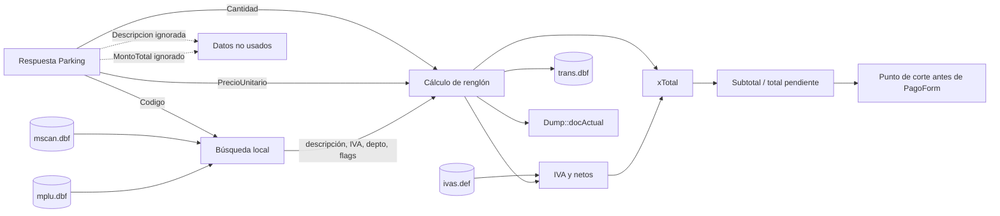

# POS legacy: cargo de Parking hasta la totalización

## 1. Objetivo y límite

Este documento releva el POS desde que el cajero ingresa `id_estadia` hasta que el cargo queda incorporado, persistido localmente y totalizado. El corte exacto es **antes de desplegar el menú gráfico de medios de pago**.

Raíz exacta del POS: `\\albsql01\zeta\pos`.

No se describe la selección, autorización ni registración de medios de pago, ni el cierre posterior de Parking. Se documenta la preparación inmediata anterior porque un middleware sustituto debe preservar las entradas y resultados que consume esta etapa.

## 2. Resumen ejecutivo

El cargo de Parking entra al POS por una función de teclado, no por un proceso en segundo plano. El cajero ingresa un ID; `ClienteParking` hace un GET sincrónico, deserializa un arreglo y conserva sólo el primer elemento. `IngIdParking` coloca `Codigo`, `Cantidad` y `PrecioUnitario` en variables globales del POS y llama a `plu(0)`.

Desde allí Parking reutiliza íntegramente el circuito normal de venta de artículos:

1. busca el código en `pos\mscan.dbf` y luego en `pos\mplu.dbf`, o directamente en `mplu.dbf`;
2. carga descripción, departamento, subdepartamento, condición de pesado, IVA e impuesto interno desde MPLU;
3. reemplaza el precio de MPLU por el recibido desde Parking;
4. calcula el importe `cantidad × precio` con reglas especiales si el material está marcado como pesado;
5. construye `DDplu_`, calcula IVA, escribe un renglón función `DPlu`/4 en `trans.dbf`, acumula en `xTotal` y agrega un `DetalleDoc` a `Dump::docActual`;
6. la tecla TOTAL ejecuta `subtot()`, suma recargos/percepciones aplicables, muestra `xTotal.VerPendiente()` y deja `pSubtot=1`;
7. si el cajero invoca el menú gráfico directamente, `mpago_(-1)` vuelve a forzar `subtot(0)` y luego llama `TotalExtendido`; éste es el límite del relevamiento.

Hallazgos relevantes para el futuro middleware:

- **HECHO:** el POS necesita un `Codigo` que exista como material local en MPLU; no alcanza con descripción y monto.
- **HECHO:** la descripción enviada por Parking no se usa para construir el renglón; se reemplaza por `mplu.des`.
- **HECHO:** `MontoTotal` recibido tampoco se usa; el POS recalcula con `Cantidad × PrecioUnitario`.
- **HECHO:** el precio recibido sí reemplaza al precio configurado en MPLU.
- **RIESGO:** el endpoint puede devolver varios ítems y el POS sólo procesa el primero.
- **RIESGO:** el material debe estar configurado coherentemente en MPLU —incluidos IVA, pesado y departamento— o la operación cambia o se rechaza.

## 3. Flujo cronológico completo

### 3.1 Entrada del ID y consulta HTTP

| Paso | Archivo y líneas | Función/clase | Comportamiento probado |
|---:|---|---|---|
| 1 | `SRC/Kernel/KBD.CPP:109-119` | tabla `kFunc` | Declara y registra `IngIdParking` como función accionable desde teclado. |
| 2 | `SRC/Functions/OperPromosServ.cpp:97-106` | `IngIdParking` | Inicializa `idParking=0` y exige cajero habilitado, `inOper==0` y `procesaParking`. |
| 3 | `SRC/Forms/frmIngNumParking.h:23-38,160-193` | `frmIngNumParking` | Captura hasta seis caracteres, filtra números y devuelve `NumIdParking` al aceptar. |
| 4 | `OperPromosServ.cpp:108-113` | `IngIdParking` | Convierte el texto a `Int32`, lo guarda en la global `idParking` y llama `ClienteParking.GetDatosParking`. |
| 5 | `LibEntidades/Alberdi/Parking/ClienteParking.cs:24-44` | `GetDatosParking` | Construye `http://host:puerto/estadia/{id}`, envía GET con `Content-Type` y `X-API-Key`, y ejecuta sincrónicamente. |
| 6 | `ClienteParking.cs:47-62` | `GetDatosParking` | En HTTP 200 deserializa `DatosParking[]`; si tiene datos devuelve `data[0]`. |
| 7 | `LibEntidades/Alberdi/Parking/DatosParking.cs:13-25` | `DatosParking` | DTO con `Cantidad:int`, `Codigo:int`, `Descripcion:string`, `MontoTotal:decimal` y `PrecioUnitario:decimal`. |
| 8 | `ClienteParking.cs:65-94` | `GetDatosParking` | Traduce 400/404/500, agrupa otros estados, captura excepciones y marca `ConError`. No hay retry ni timeout explícito en el GET. |

### 3.2 Preparación para el circuito PLU

En `SRC/Functions/OperPromosServ.cpp:112-134`, `IngIdParking` conserva el `DatosParking` retornado en `datosP`.

Si `cliParking->ConError` es verdadero, muestra un error genérico y retorna (líneas 115-119). Si `datosP` es nulo, informa que no encontró el ID (líneas 121-134). La única validación de contenido es:

```cpp
if (datosP->PrecioUnitario > 0 && datosP->Cantidad > 0)
```

Cuando pasa esa condición, las asignaciones exactas son:

| Origen DTO | Destino POS | Línea | Uso posterior |
|---|---|---:|---|
| `Codigo` | `xReg` | 125 | Código que buscará `plu_`. |
| `Cantidad` | `yReg` | 126 | Cantidad o, según configuración del material, base de importe pesado. |
| `PrecioUnitario` | `xPrecEcom` | 127 | Valor numérico auxiliar para Parking/e-commerce. |
| `PrecioUnitario.ToString("F2")` | `xsPrecEcom` | 129 | Texto de precio que efectivamente sustituye al de MPLU. |
| — | llamada `plu(0)` | 130 | Entrada al circuito normal de artículo. |

`Descripcion` y `MontoTotal` no se copian a ninguna estructura de la operación. `idParking` permanece global; está declarado en `SRC/Functions/VARIAB.CPP:290` y expuesto por `SRC/Include/OPC.H:324`.

### 3.3 Entrada y validaciones generales de PLU

`SRC/Functions/PLU.CPP:538-544`, `plu(int)`, toma el lock principal, ejecuta `CheckNewPlu()`, llama `plu_(cual)` y libera el lock.

`plu_` realiza, en orden:

1. **Código entero:** rechaza parte decimal en `xReg` (`PLU.CPP:565-575`).
2. **Escáner especial:** ejecuta `ChkSpecialScan`; si reconoce una función especial, termina (`609-618`).
3. **Estado:** pone `pSubtot=0`; rechaza modo consulta, cobranza iniciada (`inOper>1`), cuenta corriente global, falta de cajero o exceso de ítems (`621-640`).
4. **Restricciones del equipo/operación:** valida capacidad de facturar y otros modos (`642-669`).
5. **Código obligatorio:** si `xReg==0` intenta repetir un artículo anterior; en Parking normalmente `xReg` contiene `Codigo` (`676-745`).

### 3.4 Tablas de artículos y búsqueda del material

Las tablas se abren al inicializar mediante `LoadPlus`:

- `PLU.CPP:94-100` define `PLU_TBL="pos\\mplu.dbf"`, índices `mplucod.idx`, `mpludes.idx`, `mplumarc.idx`, y `SCAN_TBL="pos\\mscan.dbf"`, con índices `mscancod.idx` y `mscansc.idx`.
- `PLU.CPP:1661-1703`, `LoadPlus`, abre ambas tablas y crea/reutiliza sus índices.

La búsqueda del cargo recibido ocurre en `PLU.CPP:725-755`:

1. fija el orden `mscansc` de `dbscan` y llama `SeekInMscan` con el código;
2. si encuentra scanner, obtiene su `cod` y busca ese valor en `dbplu` con índice `mplucod`;
3. si no encuentra scanner, busca directamente `padl(xReg,6)` en `dbplu`;
4. si MPLU no contiene el material, muestra “No encuentro al Articulo...” y no registra nada.

Luego valida que el departamento esté permitido, que no esté excluido, que el material no sea uno bloqueado y que no esté en la lista de artículos excluidos (`PLU.CPP:757-824`).

**Conclusión para middleware:** `Codigo` es una clave funcional contra el maestro local. El middleware debe entregar el código acordado con la parametrización de caja; el POS no crea dinámicamente el material.

### 3.5 Campos tomados de MPLU

Una vez posicionado `dbplu`, `plu_` carga:

| Campo MPLU | Destino | Líneas | Función |
|---|---|---:|---|
| `cod` | `dplu.cod` | 826-829, 860-862 | Código real del renglón. |
| `al_peso` | `dplu.pesado` | 830-834 | Define circuito unitario/pesado. |
| `envase` | `dplu.envas` | 863-864 | Envase asociado. |
| `des` | `usades` | 865 | Descripción mostrada/impresa; reemplaza la del API. |
| `dep` | `dplu.dnro` | 867-868 | Departamento. |
| `subdep` | `dplu.sdnro` | 869-870 | Subdepartamento. |
| `cf3` | `dplu.apliPerIva` | 872-873 | Participación en percepción de IVA. |
| `seq` | `dplu.precpuntual` | 875-879 | Secuencia/precio puntual. |
| `uni` | `dplu.uni` | 881-901 | Unidades/bulto y reglas mayoristas. |
| `precio`, `precioN` | buffer/base inicial | 903-933 | Precio local que luego puede ser reemplazado. |
| `iva` | `dplu.iva` | 968-969, 1052-1054 | Índice de tasa de IVA. |
| `impint` | `dplu.montoImpInterno` | 1057-1059 | Impuesto interno por cantidad. |
| `premio` | `dplu.umillas` | 1120-1124 | Millas/premio. |
| `peso` | `dplu.pesoenbalanza` | 1150-1154 | Peso acumulable para material unitario. |

### 3.6 Reemplazo de precio y efecto del flag “pesado”

El precio local se selecciona entre `precio`, `precioN` o precio manual (`PLU.CPP:903-933`). Inmediatamente después:

```cpp
if ((janisEcom || procesaParking) && xPrecEcom != 0)
    STRCPY(precBuf, xsPrecEcom);
```

Esto está en `PLU.CPP:934-936`. Luego `basePrec = BDecimal::Parse(precBuf)` (`940-943`). En el flujo de Parking, el precio enviado queda como precio base del renglón.

**RIESGO — condición amplia:** la sustitución evalúa `procesaParking`, no `idParking>0`. Depende además de que `xPrecEcom != 0`; esa global se limpia al resetear el ticket (`DUMP.CPP:2694-2718`).

Para materiales marcados `al_peso`:

- si Parking está activo, hay `idParking>0`, el PLU es pesado y `xsJanisEsPesable` es falso, `yReg` se transforma en `cantidad × xPrecEcom` (`PLU.CPP:830-834`);
- después las ramas de pesado pueden interpretar `yReg` como monto y derivar cantidad/`ForcePrice` (`985-1024`).

Para material unitario, si `Cantidad` viene en cero se fuerza a uno; Parking ya impide cero, por lo que conserva la cantidad recibida (`1026-1050`).

**RIESGO:** `xsJanisEsPesable` aparece comentado en `OperPromosServ.cpp:128`; no se fija específicamente para Parking. La configuración `al_peso` del material puede cambiar de manera sustancial la interpretación de `Cantidad`.

### 3.7 Importe, impuestos y estructura `DDplu_`

El importe se calcula en `PLU.CPP:1086-1095`:

- si es pesado y existe `ForcePrice`, usa `ForcePrice`;
- en los demás casos usa `basePrec × yReg`, redondeado mediante `BDecimal` a uno o dos decimales según configuración de balanza.

Antes de registrar, `ValidarRegistracion(yReg, basePrec)` (`PLU.CPP:1111-1112`) verifica límites. Su implementación está en `SRC/Kernel/DUMP.CPP:82-125`: impide ticket negativo, exceso de cantidad, exceso por renglón y límites fiscal/consumidor final.

La estructura se completa con:

- `dplu.func=DPlu`, código, descripción externa en `usades`, departamento y subdepartamento (`PLU.CPP:860-870`);
- cantidad en `dplu.yReg` (`1050`);
- importe total en `dplu.xReg` (`1126-1128`);
- código originalmente recibido en `dplu.origCode` (`1128-1131`);
- lista de precio y precio unitario en centavos (`1133-1137`);
- fecha, hora y cajero (`1138-1140`);
- IVA, impuesto interno, peso y millas en las líneas antes indicadas.

### 3.8 Registración: TRANS, acumuladores y documento en memoria

`PLU.CPP:1158` llama `ProcPlu(&dplu,1)`.

#### 3.8.1 IVA

`ProcPlu`, `PLU.CPP:1238-1253`, convierte cantidad/importe, determina signo y llama `CalcIvaSap`.

`SRC/Functions/IVAS.CPP`:

- `LoadIvas`, líneas 17-38, carga tasas desde `ivas.def`;
- `CalcIvaSap`, líneas 64-88, toma `p->iva-1`, separa neto/IVA y escribe `p->impiva`;
- `CalcIva`, líneas 46-60, acumula netos en `tNetos[]` e IVA en `tIva[]`.

`ProcPlu` llama luego `CalcIva(x*signo,p->iva-1,signo)` y acumula impuestos internos (`PLU.CPP:1306-1314`).

#### 3.8.2 `trans.dbf` — renglón función 4

Con `fwrite=1`, `ProcPlu` ejecuta `WriteDump(p)` (`PLU.CPP:1257-1259`).

`SRC/Kernel/DUMP.CPP` prueba:

- `FILE1="trans.dbf"` y el controlador `tDbf` (`líneas 20-31`);
- el esquema de TRANS en `crStr` (`45-55`), con campos como tienda, caja, función, precio, cajero, importe, IVA, cantidad, código, scanner/pesado, fecha, hora, canal e importe IVA;
- `OpenTransFiles` abre o crea la tabla (`1100-1127`);
- `WriteDump` hace `AppendBlank`, codifica la unión `Dump_`, ejecuta `Flush` y vacía buffers (`339-350`).

El identificador `DPlu` corresponde al tipo de renglón de venta por artículo; otros lectores del proyecto comparan `func==4`, por ejemplo `SRC/Functions/Plugin.cpp:939-955`. Por eso este cargo queda representado como un renglón normal función 4.

#### 3.8.3 Acumulador `xTotal`

`ProcPlu` suma el importe a `xTotal` con `xTotal.AddVenta(...)`, incrementa `xCnt`, calcula IVA y fija `inOper=1` (`PLU.CPP:1306-1319`).

`SRC/Include/Total.h:58-160` define `tagTotal`:

- `venta`: suma de artículos;
- `pagos`: importes ya pagados;
- `descuentos`: descuentos generales;
- `recargos`: cargos adicionales;
- `VerTotal()`: venta menos descuentos más recargos (`146-160`);
- `VerPendiente()`: parte del total y resta pagos (`114-122`);
- `Clear()`: reinicia venta, pagos, recargos y otros acumuladores (`136-144`).

La instancia global se crea en `SRC/Kernel/POS.CPP:19` como `tagTotal xTotal`.

#### 3.8.4 `Dump::docActual`

`ProcPlu`, `PLU.CPP:1325-1352`, crea si hace falta un `HeaderDoc` y completa caja, cajero, tienda, canal, vendedor y fecha. Después agrega un `DetalleDoc` con código, departamentos, código original, IVA, importe, cantidad, precio, millas, indicador de escaneado, hora y número de registro TRANS.

Las clases están en:

- `LibEntidades/Alberdi/HeaderDoc.cs:8-64`: cabecera y listas de detalle, promociones, impuestos y pagos;
- `LibEntidades/Alberdi/DetalleDoc.cs:8-23`: forma del ítem en memoria.

En este punto `HeaderDoc.Total` todavía no se asigna en el fragmento relevado; la autoridad operativa para el total en pantalla es `xTotal`.

### 3.9 Visualización después de agregar el cargo

Al volver de `ProcPlu`, `PLU.CPP:1160-1164`:

1. limpia repetición y `yReg`;
2. llama `PrintTktTot()`;
3. comprueba desborde de precio y limpia la entrada.

`SRC/Devices/POSDISP.CPP:201-256`, `PrintTktTot`, obtiene `xTotal.VerPendiente().ToString(2)` y muestra `TOTAL=...` mediante `MainForm::SetTotDisplay`. Éste es el primer total visible después de incorporar el cargo, pero aún no marca que el operador haya pulsado TOTAL.

## 4. Totalización y límite anterior al menú de pagos

### 4.1 Tecla TOTAL/SUBTOTAL

`SRC/Kernel/KBD.CPP:65-75,114-119` registra `subtot` en la tabla de funciones.

`SRC/Functions/SUBTOT.CPP:1054-1122` contiene el flujo:

1. `subtot` toma el lock y delega en `subtot_` (`1054-1060`).
2. Rechaza modo consulta, total cero o entrada numérica pendiente (`1062-1078`).
3. Si corresponde, calcula recargo y percepciones mediante `FactuReca`, `FactuPercep`, `FactuPercepTissh` y `FactuPercepIva` (`1080-1086`). Sus implementaciones están en `SRC/Functions/FACTU.CPP:810`, `836`, `916` y `994`.
4. Puede sincronizar/imprimir subtotal con el impresor fiscal (`1087-1109`).
5. Vuelve a mostrar el total con `PrintTktTot`, muestra al cliente `xTotal.VerPendiente()`, limpia la entrada y fija `pSubtot=1` (`1114-1122`).

**Estado al terminar `subtot_`:** `inOper==1`, el renglón está en TRANS y `Dump::docActual`, `xTotal` contiene venta/descuentos/recargos, `xReg=yReg=0` por `HClear`, y `pSubtot==1`.

### 4.2 Invocación del menú gráfico y corte exacto

La función de medios de pago se registra como `mpago` en `KBD.CPP:73-75,114-119`. Para abrir el menú gráfico recibe `cual==-1`.

`SRC/Functions/MPAGO.CPP:1518-1603`, `mpago_`, antes de mostrarlo:

1. valida modo, monto mínimo, envases, anulaciones y límites (`1528-1557`);
2. calcula promociones anteriores al medio de pago (`1560-1572`);
3. valida que exista una operación y no haya números pendientes (`1582-1597`);
4. **fuerza nuevamente `subtot(0)` si `inOper==1`** (`1599-1600`);
5. crea la lista de resultados y llama `TotalExtendido(res)` (`1602-1603`).

`TotalExtendido` está en `MPAGO.CPP:562-595` y arma la jerarquía de medios; termina llamando al editor gráfico. `EditaPagoExtendido`, `MPAGO.CPP:474-535`, lee `xTotal.VerPendiente()`, construye `PagoForm` y ejecuta `ShowDialog()` en líneas 515-518.

**Corte de este relevamiento:** inmediatamente después del `subtot(0)` de `MPAGO.CPP:1600` y antes de `TotalExtendido(res)` en la línea 1603. En ese instante el monto definitivo previo a seleccionar medio está disponible como `xTotal.VerPendiente()`.

## 5. Tablas, archivos y estructuras intervinientes

| Recurso | Tipo | Lectura/escritura | Campos relevantes en esta etapa | Evidencia |
|---|---|---|---|---|
| `pos\mscan.dbf` | DBF maestro de scanners | Lectura | scanner/código | `PLU.CPP:98-100,725-737,1695-1703` |
| `pos\mplu.dbf` | DBF maestro de artículos | Lectura | código, descripción, departamento, subdepartamento, pesado, precios, IVA, impuesto interno, unidad, peso, millas | `PLU.CPP:94-97,740-1059,1661-1693` |
| `ivas.def` | archivo de definición | Lectura al iniciar | descripción y porcentaje por tasa | `IVAS.CPP:17-38` |
| `trans.dbf` | DBF transaccional local | Escritura inmediata | función, código, cantidad, importe, precio, IVA, cajero, tienda, caja, fecha/hora, canal | `DUMP.CPP:20-55,339-350,1100-1127` |
| `transctl.dbf` | DBF de control | Control de posición/sync | `act_trans`, `l_sync` | `DUMP.CPP:20-23,60` |
| `xTotal` | objeto global `tagTotal` | Memoria | venta, descuentos, recargos, pagos, pendiente | `Total.h:58-160`; `POS.CPP:19` |
| `DDplu_ dplu` | estructura de renglón | Memoria y codificación a TRANS | material, cantidad, importe, precio, IVA, fecha/hora, cajero | `PLU.CPP:860-1158`; definición en `SRC/Include/FUNCS.H` |
| `Dump::docActual` | `HeaderDoc` | Memoria | cabecera, detalles, promociones, impuestos, pagos | `PLU.CPP:1325-1352`; `HeaderDoc.cs:8-64` |
| `DetalleDoc` | DTO interno | Memoria | código, importe, precio, cantidad, IVA, departamentos, registro TRANS | `DetalleDoc.cs:8-23` |
| `idParking` | global `int` | Memoria | ID original de estadía | `OperPromosServ.cpp:99-113`; `VARIAB.CPP:290` |
| `xPrecEcom` / `xsPrecEcom` | globales | Memoria | precio recibido numérico/textual | `OperPromosServ.cpp:127-129`; `VARIAB.CPP:48,214` |

## 6. Transformación de datos relevante para middleware

| Dato recibido | Uso real | Fuente final del renglón | Resultado |
|---|---|---|---|
| `id_estadia` | Correlación global y consulta | Entrada del cajero | No se guarda dentro de `DetalleDoc` ni en el renglón PLU de TRANS. |
| `Codigo` | Búsqueda de material | Código normalizado de MPLU | Obligatorio y debe existir localmente. |
| `Descripcion` | Sólo queda en `DatosParking`/log | `mplu.des` | La descripción del API se pierde. |
| `Cantidad` | Alimenta `yReg` | Reglas unitario/pesado | Puede transformarse si MPLU marca `al_peso`. |
| `PrecioUnitario` | Sustituye `precBuf` | API Parking | Se convierte a texto F2, luego `BDecimal`, y a centavos en `dplu.precuni`. |
| `MontoTotal` | Ninguno | Recalculado por POS | Se pierde; no se valida contra cantidad × precio. |
| IVA | No llega del API | `mplu.iva` + `ivas.def` | Calculado completamente por POS. |
| Impuesto interno | No llega del API | `mplu.impint` | Calculado por POS según cantidad. |
| Departamento/subdepartamento | No llegan | MPLU | Controlan permisos y clasificación. |

## 7. Manejo de errores hasta la totalización

| Punto | Condición | Resultado |
|---|---|---|
| Cliente HTTP | error HTTP, JSON o red | `ConError=true`, log `LogParking.txt`, alerta genérica y retorno. |
| `IngIdParking` | objeto nulo | Alerta de ID no encontrado. |
| `IngIdParking` | precio/cantidad no positivos | No agrega ítem y tampoco muestra una alerta específica dentro de esa rama. |
| `plu_` | código inexistente en MPLU | Alerta y retorno sin escribir TRANS. |
| `plu_` | departamento/artículo excluido | Alerta y retorno. |
| `plu_` | incompatibilidad unitario/pesado | Alerta y retorno. |
| `ValidarRegistracion` | límites o total negativo | Alerta y rechazo del renglón. |
| `WriteDump` | error DBF | La infraestructura llama mecanismos de error fatal/`AbnormalEnd` en fallos de codificación; no hay rollback transaccional equivalente a SQL. |
| `subtot_` | total cero o número pendiente | Alerta y no totaliza. |
| `mpago_(-1)` | operación inválida | Alerta/retorno antes de abrir el menú. |

## 8. Riesgos y vacíos

1. **Sólo primer detalle:** `ClienteParking.cs:50-55` descarta elementos adicionales.
2. **Total del servidor ignorado:** `MontoTotal` no participa de ninguna validación.
3. **Descripción del servidor ignorada:** la caja usa `mplu.des`.
4. **Dependencia fuerte de maestro local:** código, IVA, departamento y flags deben estar sincronizados en cada caja.
5. **Semántica de pesado:** una parametrización incorrecta modifica cantidad/importe.
6. **Precio global compartido:** `xPrecEcom`/`xsPrecEcom` son globales reutilizadas también por e-commerce.
7. **Flag amplio:** la sustitución de precio evalúa `procesaParking`, no sólo una correlación activa de Parking.
8. **ID no unido al renglón:** `idParking` no queda dentro del `DetalleDoc` ni entre los campos PLU codificados en TRANS; la correlación depende de la global hasta etapas posteriores.
9. **Persistencia DBF sin transacción SQL:** `AppendBlank` + reemplazos + `Flush`; no existe rollback atómico visible.
10. **Precisión mixta:** API usa `decimal`, el puente convierte a `double`, texto F2 y luego `BDecimal`; existen varios puntos de conversión/redondeo.
11. **Promociones previas al menú:** `mpago_` ejecuta `CalcularPromosAntesMP`; el importe inmediatamente anterior al menú puede no ser sólo el PLU de Parking si el ticket admite otros elementos/reglas.
12. **No se determinó** el mapeo físico exacto de teclas para `IngIdParking`, `subtot` y `mpago`; sí se confirmó su posición en `kFunc`.

## 9. Información disponible en el punto de corte

Justo antes de desplegar `PagoForm`, quedan disponibles:

- `idParking`: ID ingresado;
- `inOper==1`: ticket abierto;
- `pSubtot==1`: subtotal ejecutado;
- `xTotal.VerVenta()`: suma de renglones;
- `xTotal.VerTotal()`: venta menos descuentos más recargos;
- `xTotal.VerPendiente()`: total menos pagos previos; antes del primer pago es el monto a cobrar;
- `tNetos[]`, `tIva[]`, `tNetosIva[]`, `AcumImpuestosInternos`: acumuladores impositivos;
- renglón función 4 persistido en `trans.dbf`;
- `Dump::docActual` con `HeaderDoc` y al menos un `DetalleDoc`;
- datos maestros resueltos: código, descripción local, departamento, subdepartamento, IVA y flags del artículo.

## 10. Diagrama Mermaid de secuencia

```mermaid
sequenceDiagram
    actor Cajero
    participant Form as frmIngNumParking
    participant Oper as IngIdParking
    participant Parking as ClienteParking / API
    participant PLU as plu_ / ProcPlu
    participant MSCAN as mscan.dbf
    participant MPLU as mplu.dbf
    participant IVA as ivas.def / IVAS.CPP
    participant TRANS as trans.dbf
    participant Total as xTotal
    participant Doc as Dump::docActual
    participant Subtot as subtot_

    Cajero->>Form: Ingresar id_estadia
    Form-->>Oper: NumIdParking
    Oper->>Parking: GetDatosParking(idParking)
    Parking-->>Oper: Primer DatosParking
    Oper->>Oper: xReg=Codigo, yReg=Cantidad
    Oper->>Oper: xsPrecEcom=PrecioUnitario F2
    Oper->>PLU: plu(0)
    PLU->>MSCAN: Buscar código/scanner
    alt Scanner asociado
        MSCAN-->>PLU: Código MPLU
    else Sin scanner
        MSCAN-->>PLU: No encontrado
    end
    PLU->>MPLU: Buscar material por código
    MPLU-->>PLU: descripción, flags, IVA, precio y clasificación
    PLU->>PLU: Reemplazar precio MPLU por precio Parking
    PLU->>PLU: Calcular cantidad e importe
    PLU->>IVA: CalcIvaSap / CalcIva
    IVA-->>PLU: Neto e IVA acumulados
    PLU->>TRANS: WriteDump renglón DPlu (función 4)
    PLU->>Total: AddVenta(importe)
    PLU->>Doc: Agregar DetalleDoc
    PLU->>Total: Mostrar total corriente
    Cajero->>Subtot: Pulsar TOTAL o invocar menú de pagos
    Subtot->>Total: Aplicar recargos/percepciones y VerPendiente
    Subtot-->>Cajero: Total mostrado
    Note over Cajero,Total: Operación totalizada; punto anterior al menú de medios de pago
```

## 11. Diagrama de dependencias de datos


